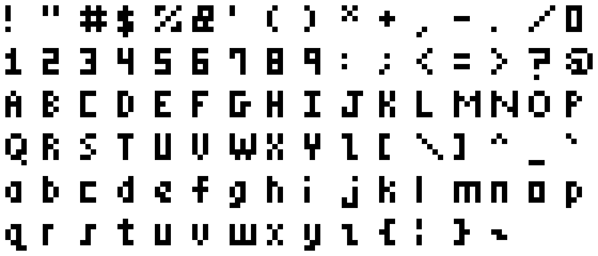
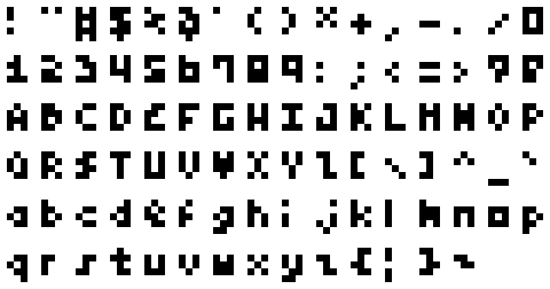
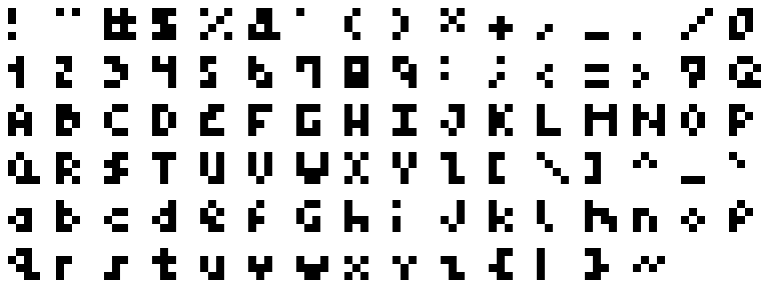
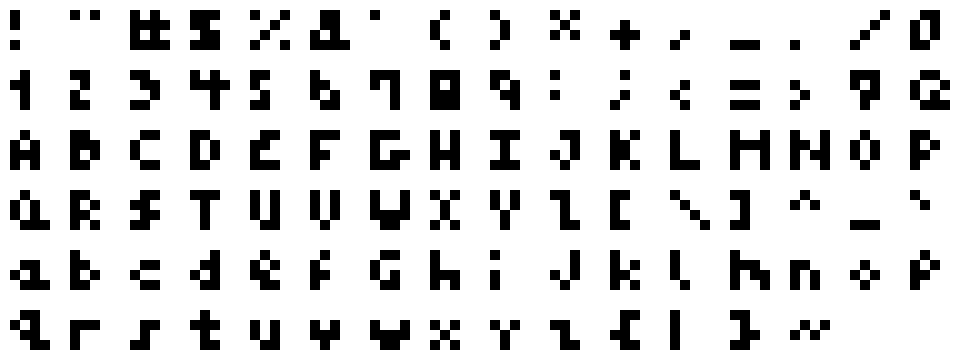
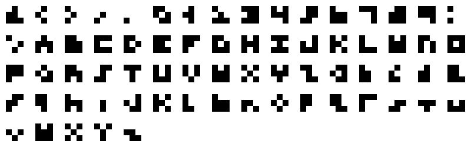

# 

Proportional and monospace pixel font family. See the
**[demo](https://mem-font.netlify.app/demo.html)**.

## Table of contents

<!-- @import "[TOC]" {cmd="toc" depthFrom=2 depthTo=6 orderedList=false} -->
<!-- code_chunk_output -->

- [Table of contents](#table-of-contents)
- [Install](#install)
- [mem-prop 5x6](#mem-prop-5x6)
- [mem-prop 5x5](#mem-prop-5x5)
- [mem-prop 3x5](#mem-prop-3x5)
- [mem-prop 4x4](#mem-prop-4x4)
- [mem-mono 4x4](#mem-mono-4x4)
- [mem-mono 3x3](#mem-mono-3x3)
- [Known issues](#known-issues)
- [Development](#development)
  - [System Prerequisites](#system-prerequisites)
  - [Image Diff](#image-diff)
  - [Testing the TTF](#testing-the-ttf)
- [Links](#links)
  - [Alternatives](#alternatives)
  - [References](#references)
- [License (GPL-3.0-only)](#license-gpl-30-only)
  - [GPL-3.0-only](#gpl-30-only)

<!-- /code_chunk_output -->

## Install
```bash
npm i mem-font
```

See the [changelog](doc/changelog.md) for release notes.

## mem-prop 5x6
<a href="dist/mem-prop-5x6-10x.png">
  
</a>

**[Download](https://mem-font.netlify.app/dist/mem-prop-5x6.ttf)**

## mem-prop 5x5
<a href="dist/mem-prop-5x5-10x.png">
  
</a>

**[Download](https://mem-font.netlify.app/dist/mem-prop-5x5.ttf)**

## mem-prop 3x5
<a href="dist/mem-prop-3x5-10x.png">
  
</a>

**[Download](https://mem-font.netlify.app/dist/mem-prop-3x5.ttf)**

## mem-prop 4x4
<a href="dist/mem-prop-4x4-10x.png">
  
</a>

**[Download](https://mem-font.netlify.app/dist/mem-prop-4x4.ttf)**

## mem-mono 4x4
<a href="dist/mem-mono-4x4-10x.png">
  
</a>

**[Download](https://mem-font.netlify.app/dist/mem-mono-4x4.ttf)**

## mem-mono 3x3
<a href="dist/mem-mono-3x3-10x.png">
  
</a>

**[Download](https://mem-font.netlify.app/dist/mem-mono-3x3.ttf)**

## Known issues

- [Aseprite does not support kerning](https://github.com/aseprite/aseprite/issues/1877),
  only variable widths. This means sequences such as "zz" and "rj" will be the
  same distance apart as any other sequence such as "ab". These fonts should
  exhibit correct kerning in GIMP and other programs. As a workaround, these
  fonts includes the most prevalent kerning in the character widths and then
  subtracts it from the overall kerning for supporting programs.

See the [to-do](todo.md) for more issues.

## Development

### System Prerequisites
- aseprite
- fontforge
- potrace

You can install the lot on Ubuntu with `sudo apt install fontforge potrace`.

### Image Diff
Image diffing with Git is useful for verifying changes but requires a custom
configuration. One possible setup is described in
[git-diff-img](https://github.com/niedzielski/git-diff-img)

### Testing the TTF
On Ubuntu, symlink the TTFs in dist to ~/.fonts. You may need to regenerate your
font cache depending on the change made: `fc-cache -f -v`. The latter seems
necessary for GIMP (and takes effect on next any text layout change) but not
Aseprite which references the TTF files directly.

## Links

### Alternatives
- [Silkscreen](http://kottke.org/plus/type/silkscreen/)
- [msx-font](https://git.ateijelo.com/ateijelo/msx-font.git)
- [m3x6](https://managore.itch.io/m3x6)
- [creep](https://github.com/romeovs/creep)
- [Press Start 2P](https://fonts.google.com/specimen/Press+Start+2P)

### References
- [Creating a Pixel Font for Your Game](http://monsterfacegames.blogspot.com/2013/10/creating-pixel-font-for-your-game.html)
- [Teleglitch](http://www.teleglitch.com/)
- [FontForge Documentation](https://fontforge.github.io/en-US/documentation/)
- [FontForge Python Scripting](https://fontforge.org/docs/scripting/python/fontforge.html)
- [FontForge Bitmap Strikes Documentation](https://fontforge.org/docs/tutorial/editexample8.html)

## License (GPL-3.0-only)

© Stephen Niedzielski.

### GPL-3.0-only

This program is free software: you can redistribute it and/or modify it under
the terms of the GNU General Public License as published by the Free Software
Foundation, version 3.

This program is distributed in the hope that it will be useful, but WITHOUT ANY
WARRANTY; without even the implied warranty of MERCHANTABILITY or FITNESS FOR A
PARTICULAR PURPOSE. See the GNU General Public License for more details.

You should have received a copy of the GNU General Public License along with
this program. If not, see <https://www.gnu.org/licenses/>.
