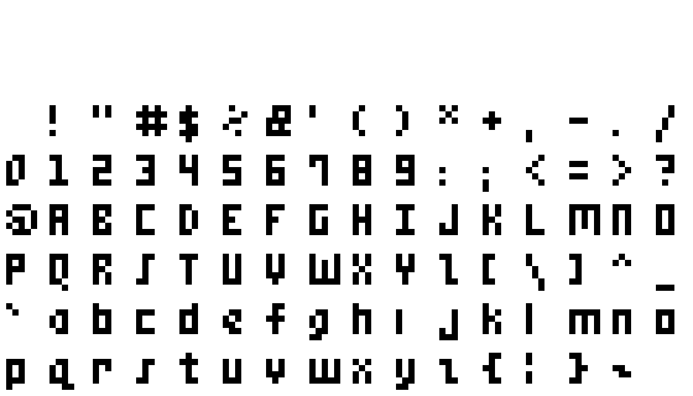
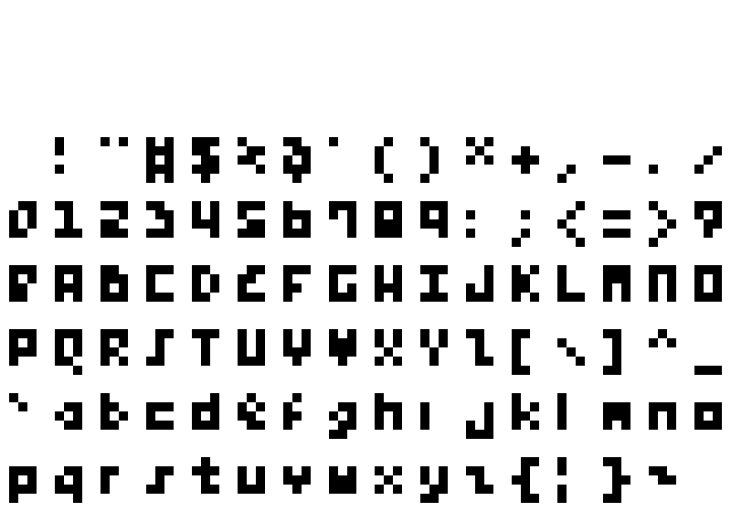
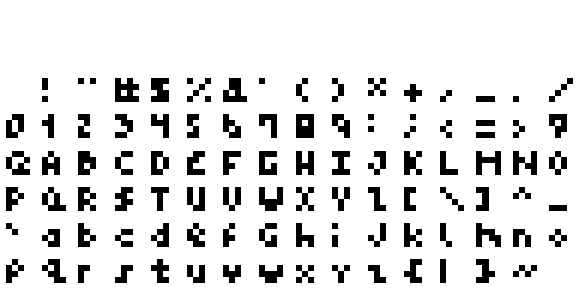
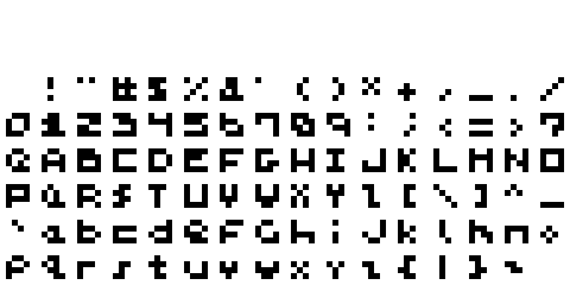
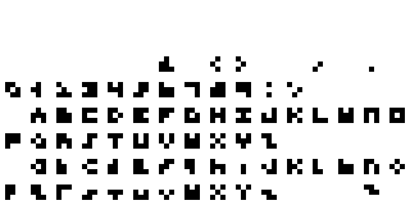

# 

Proportional and monospaced sans light pixel font family. See the
**[demo](https://rndmem.com)** or [download the fonts](#fonts) as TTFs and
sprite sheets. Developed in FontForge and Aseprite.

## Install

mem is a Deno TypeScript project. Add `https://deno.land/x/mem/mod.ts` to your
import modules and reference the `https://deno.land/x/mem/mods.json` import map.

See the [changelog](changelog.md) for release notes.

## Files

- **\*.ttf**: TrueType font file. The format is
  `mem-<variable width>-<width>x<height>` where "variable width" is `prop` for
  proportional or `mono` for monospaced, and width and height are cell width and
  height in pixels. Files containing "-aseprite" in their name have their
  kerning multiplied for correct rendering in Aseprite.
- **\*.json**: font metadata (kerning and other metrics for games).
- **\*-sheet.png**: 1x spritesheet (for games)
- **\*-sheet.json**: 1x Aseprite metadata (for games)
- \*.sfd: FontForge file (mostly for debugging the TTF).
- \*-10x-sheet.png: 10x spritesheet (mostly for demoing in the readme and easier
  diffing).
- \*-10x-sheet.json: Aseprite metadata for the 10x spritesheet.
- \*.ttfdump: True Type Font File Dumper dumps for each TTF (for debugging and
  tracking changes). Files containing "-aseprite" in their name have their
  kerning multiplied for correct rendering in Aseprite.

See also [font metadata](#font-metadata) and
[Aseprite metadata](#aseprite-metadata) sections below.

## Fonts

All characters in each font set appear below. Blank cells are missing
(undefined) characters. The fonts are ordered from greatest to least line height
with tie-breakers going to greatest width then proportional font.

### mem 5x6

<a href="dist/mem-prop-5x6-10x-sheet.png">
  
</a>

**[Download](dist/mem-prop-5x6.ttf)**

### mem 5x5

<a href="dist/mem-prop-5x5-10x-sheet.png">
  
</a>

**[Download](dist/mem-prop-5x5.ttf)**

### mem 3x5

<a href="dist/mem-prop-3x5-10x-sheet.png">
  
</a>

**[Download](dist/mem-prop-3x5.ttf)**

### mem 4x4

<a href="dist/mem-prop-4x4-10x-sheet.png">
  
</a>

**[Download](dist/mem-prop-4x4.ttf)**

### mem mono 4x4

<a href="dist/mem-mono-4x4-10x-sheet.png">
  
</a>

**[Download](dist/mem-mono-4x4.ttf)**

### mem mono 3x3

<a href="dist/mem-mono-3x3-10x-sheet.png">
  
</a>

**[Download](dist/mem-mono-3x3.ttf)**

## Font Metadata

Additional information for the font including name, kerning, and other layout
metrics.

## Aseprite Metadata

Additional information spritesheet interpretation. See the
[aseprite-atlas definition](https://github.com/oidoid/aseprite-atlas/blob/master/src/types/Aseprite.ts).

## Known issues

- [Aseprite kerning is strange](https://github.com/aseprite/aseprite/issues/1877).
  As a workaround, Aseprite-specific files are generated with the kerning
  multiplied by the cell height. It's also quite possible this font has
  incorrect kerning.
- [Sprite sheet dimensions are not powers of two](https://github.com/aseprite/aseprite/issues/2289).
- [Live Server](https://github.com/tapio/live-server) now appears unmaintained.
  Caching must be disabled via browser Dev Tools for changes to appear.

See the [to-do](todo.md) for more issues.

## Design Principles

### mem 5x6

- Excellent high- and low-scale (compact) readability, smoothness (pixel
  clustering), and visual consistency of the whole character set at the expense
  of form adherence for individual characters. For example, the lowercase o
  could be rounder but this comes at the cost of making the font noisier and it
  is very legible square rather than round. As a counterexample, the lowercase g
  could be smoother but then it looks too similar to the lowercase o so some
  exceptions are made.
- Favor 3x5 pixels for every capital character.
- Favor 3x4 pixels for every lowercase character.
- Every numeric is the same width and height, 3x5 pixels, so that countdowns
  don't shift.
- The preferred inflection for lowercase is one pixel from the top, for the sake
  of the lowercase e. Everything else is two pixels from the top.
- The font is sans so avoid serifs.
- The font is light so avoid pixel doubling.

## Development

### NPM scripts

The development workflow is based around the `start` NPM script:

```lang=sh
npm -s start
```

However, you must manually call `npm -s run build` to see any font changes.

- `install` / `i`: install project dependencies.
- `test` / `t`: run all tests. See [tests](#tests).
- `run format`: apply lint fixes automatically where available.
- `version`: increment the version and publish a new release. See
  [versioning](#versioning).

💡 Tip: add `-s` to omit verbose command echoing. E.g., `npm -s i` or
`npm -s run format`.

Undocumented scripts are considered internal utilities and not expressly
supported workflows.

### Tests

- Font metadata JSON is type-checked with TypeScript to ensure it conforms to
  the shape expected.
- Additional properties can leak in but the advertised API must be true.

### Aseprite

Aseprite is open-source and excellent for pixel graphics. A big chunk of this
repo is making a workflow from Aseprite through FontForge.

GIMP was used up through v4.0.0 but I like Aseprite a lot better for pixeling.

### System Prerequisites

- [Aseprite](https://www.aseprite.org) v1.2.20-x64
- [FontForge](https://fontforge.org) v20190801
- [Potrace](http://potrace.sourceforge.net) v1.16
- True Type Font File Dumper (ttfdump) v2019.20190605.51237-3build2

You can install the latter three on Ubuntu with
`sudo apt install fontforge potrace texlive-binaries`.

### Image Diff

Image diffing with Git is useful for verifying changes but requires a custom
configuration. One possible setup is described in
[git-diff-img](https://github.com/niedzielski/git-diff-img)

### Testing the TTF

On Ubuntu, symlink the TTFs in dist to ~/.fonts. You may need to regenerate your
font cache depending on the change made: `fc-cache -f -v`. The latter seems
necessary for GIMP (and takes effect on next any text layout change) but not
Aseprite which references the TTF files directly.

## Links

### Alternatives

- [Silkscreen](http://kottke.org/plus/type/silkscreen/)
- [msx-font](https://git.ateijelo.com/ateijelo/msx-font.git)
- [m3x6](https://managore.itch.io/m3x6)
- [creep](https://github.com/romeovs/creep)
- [Press Start 2P](https://fonts.google.com/specimen/Press+Start+2P)

## [To-Do](todo.md)

### References

- [Creating a Pixel Font for Your Game](http://monsterfacegames.blogspot.com/2013/10/creating-pixel-font-for-your-game.html)
- [Teleglitch](http://www.teleglitch.com/)
- [FontForge Documentation](https://fontforge.github.io/en-US/documentation/)
- [FontForge Python Scripting](https://fontforge.org/docs/scripting/python/fontforge.html)
- [FontForge Bitmap Strikes Documentation](https://fontforge.org/docs/tutorial/editexample8.html)

## License

© oidoid.

### AGPL-3.0-only

This program is free software: you can redistribute it and/or modify it under
the terms of the GNU Affero General Public License as published by the Free
Software Foundation, either version 3 of the License, or (at your option) any
later version.

This program is distributed in the hope that it will be useful, but WITHOUT ANY
WARRANTY; without even the implied warranty of MERCHANTABILITY or FITNESS FOR A
PARTICULAR PURPOSE. See the GNU Affero General Public License for more details.

You should have received a copy of the GNU Affero General Public License along
with this program. If not, see <https://www.gnu.org/licenses/>.

```
╭>°╮┬┌─╮╭─╮┬┌─╮
│  │││ ││ │││ │
╰──╯┴└─╯╰─╯┴└─╯
```
