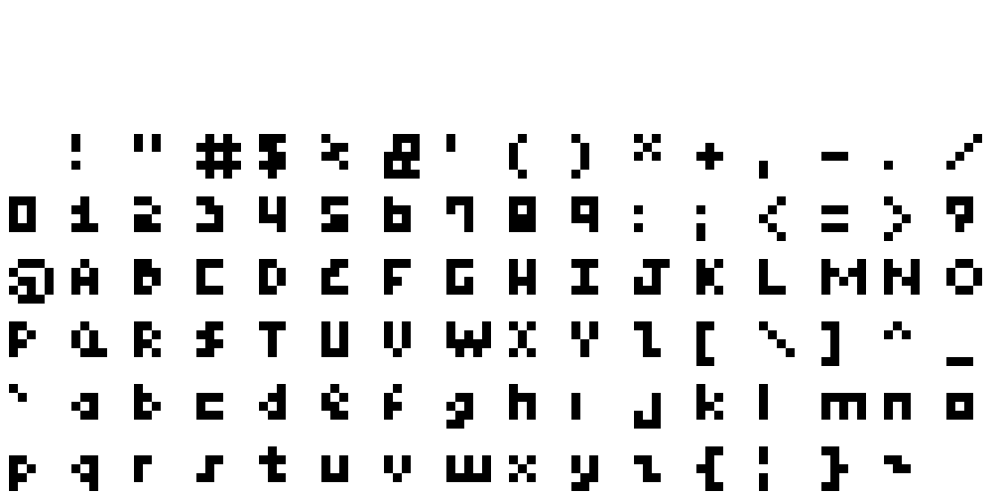

# 

Proportional and monospace pixel font family. See the
**[demo](https://rndmem.com)** or [download the fonts](#fonts).

## Table of contents

<!-- @import "[TOC]" {cmd="toc" depthFrom=2 depthTo=6 orderedList=false} -->
<!-- code_chunk_output -->

- [Table of contents](#table-of-contents)
- [Install](#install)
- [Files](#files)
- [Fonts](#fonts)
  - [mem proportional 5x6](#mem-proportional-5x6)
  - [mem proportional 5x5](#mem-proportional-5x5)
  - [mem proportional 3x5](#mem-proportional-3x5)
  - [mem proportional 4x4](#mem-proportional-4x4)
  - [mem monospaced 4x4](#mem-monospaced-4x4)
  - [mem monospaced 3x3](#mem-monospaced-3x3)
- [Font Metadata](#font-metadata)
- [Aseprite Metadata](#aseprite-metadata)
- [Known issues](#known-issues)
- [Design Principles](#design-principles)
  - [mem proportional 5x6](#mem-proportional-5x6-1)
- [Development](#development)
  - [Tests](#tests)
  - [Aseprite](#aseprite)
  - [System Prerequisites](#system-prerequisites)
  - [Image Diff](#image-diff)
  - [Testing the TTF](#testing-the-ttf)
- [Links](#links)
  - [Alternatives](#alternatives)
  - [References](#references)
- [License (GPL-3.0-only)](#license-gpl-30-only)
  - [GPL-3.0-only](#gpl-30-only)

<!-- /code_chunk_output -->

## Install

```bash
npm i mem-font
```

See the [changelog](doc/changelog.md) for release notes.

## Files

- **\*.ttf**: TrueType font file. The format is
  `mem-<variable width>-<width>x<height>` where where "variable width" is `prop`
  for proportional or `mono` for monospaced, and width and height are cel width
  and height in pixels.
- **\*.json**: font metadata (kerning and other metrics for games).
- **\*-sheet.png**: 1x spritesheet (for games)
- **\*-sheet.json**: 1x Aseprite metadata (for games)
- \*.sfd: FontForge file (mostly for debugging the TTF).
- \*-10x-sheet.png: 10x spritesheet (mostly for demoing in the readme and easier
  diffing).
- \*-10x-sheet.json: Aseprite metadata for the 10x spritesheet.
- \*.ttfdump: True Type Font File Dumper dumps for each TTF (for debugging and
  tracking changes).

See also [font metadata](#font-metadata) and
[Aseprite metadata](#aseprite-metadata) sections below.

## Fonts

All characters in each font set appear below. Blank cels are missing (undefined)
characters. The fonts are ordered from greatest to least line height with tie
breakers going to greatest width then proportional font.

### mem proportional 5x6

<a href="dist/mem-prop-5x6-10x-sheet.png">
  
</a>

**[Download](https://mem-font.netlify.app/dist/mem-prop-5x6.ttf)**

### mem proportional 5x5

<a href="dist/mem-prop-5x5-10x-sheet.png">
  
</a>

**[Download](https://mem-font.netlify.app/dist/mem-prop-5x5.ttf)**

### mem proportional 3x5

<a href="dist/mem-prop-3x5-10x-sheet.png">
  
</a>

**[Download](https://mem-font.netlify.app/dist/mem-prop-3x5.ttf)**

### mem proportional 4x4

<a href="dist/mem-prop-4x4-10x-sheet.png">
  
</a>

**[Download](https://mem-font.netlify.app/dist/mem-prop-4x4.ttf)**

### mem monospaced 4x4

<a href="dist/mem-mono-4x4-10x-sheet.png">
  
</a>

**[Download](https://mem-font.netlify.app/dist/mem-mono-4x4.ttf)**

### mem monospaced 3x3

<a href="dist/mem-mono-3x3-10x-sheet.png">
  
</a>

**[Download](https://mem-font.netlify.app/dist/mem-mono-3x3.ttf)**

## Font Metadata

Additional information for the font including name, kerning, and other layout
metrics.

## Aseprite Metadata

Additional information spritesheet interpretation. See the
[aseprite-atlas definition](https://github.com/oddoid/aseprite-atlas/blob/master/src/types/Aseprite.ts).

## Known issues

- [Aseprite does not support kerning](https://github.com/aseprite/aseprite/issues/1877),
  only variable widths. This means sequences such as "zz" and "rj" will be the
  same distance apart as any other sequence such as "ab". These fonts should
  exhibit correct kerning in a web browser, GIMP, and other programs. As a
  workaround, these fonts includes the most prevalent kerning in the character
  widths and then subtracts it from the overall kerning for supporting programs.
- Aseprite kind of supports leading in the sense that it tries to make room for
  the ascenders and descenders but doesn't seem to support newlines. This means
  the `line_height` is the correct font size to use in Aseprite not the wxh
  size. For example, to use the 5x6 font in Aseprite, set the font size to 7px.
- [Sprite sheet dimensions are not powers of two](https://github.com/aseprite/aseprite/issues/2289).
- [Live Server](https://github.com/tapio/live-server) now appears unmaintained.
  Caching must be disabled via browser Dev Tools for changes to appear.

See the [to-do](todo.md) for more issues.

## Design Principles

### mem proportional 5x6

- Visual consistency and smoothness (pixel clustering) of the whole character
  set at the expense of form adherence for individual characters. For example,
  the lowercase o could be rounder but this comes at the cost of making the font
  noisier and it is very legible square rather than round. As a counterexample,
  the lowercase j could be smoother but it looks unbalanced, so in some cases
  exceptions are made. Similarly, the lowercase p could be smoother but then it
  looks too similar to the lowercase o.
- Favor 4x5 pixels for every capital character.
- Favor 3x4 pixels for every lowercase character.
- Every numeric is the same width and height, 3x5 pixels, so that countdowns
  don't shift.
- The preferred inflection for lowercase is one pixel from the top, for the sake
  of e. Everything else is two pixels from the top.

## Development

### NPM scripts

The development workflow is based around the `start` NPM script:

```lang=sh
npm -s start
```

However, you must manually call `npm -s run build` to see any font changes.

- `install` / `i`: install project dependencies.
- `test` / `t`: run all tests. See [tests](#tests).
- `run format`: apply lint fixes automatically where available.
- `version`: increment the version and publish a new release. See
  [versioning](#versioning).

💡 Tip: add `-s` to omit verbose command echoing. E.g., `npm -s i` or
`npm -s run format`.

Undocumented scripts are considered internal utilities and not expressly
supported workflows.

### Tests

- Font metadata JSON is type-checked with TypeScript to ensure it conforms to
  the shape expected.
- Additional properties can leak in but the advertised API must be true.

### Aseprite

Aseprite is open-source and excellent for pixel graphics. A big chunk of this
repo is making a workflow from Aseprite through FontForge.

GIMP was used up through v4.0.0 but I like Aseprite a lot better for pixeling.

### System Prerequisites

- [Aseprite](https://www.aseprite.org) v1.2.20-x64
- [FontForge](https://fontforge.org) v20190801
- [Potrace](http://potrace.sourceforge.net) v1.16
- True Type Font File Dumper (ttfdump) v2019.20190605.51237-3build2

You can install the latter three on Ubuntu with
`sudo apt install fontforge potrace texlive-binaries`.

### Image Diff

Image diffing with Git is useful for verifying changes but requires a custom
configuration. One possible setup is described in
[git-diff-img](https://github.com/niedzielski/git-diff-img)

### Testing the TTF

On Ubuntu, symlink the TTFs in dist to ~/.fonts. You may need to regenerate your
font cache depending on the change made: `fc-cache -f -v`. The latter seems
necessary for GIMP (and takes effect on next any text layout change) but not
Aseprite which references the TTF files directly.

## Links

### Alternatives

- [Silkscreen](http://kottke.org/plus/type/silkscreen/)
- [msx-font](https://git.ateijelo.com/ateijelo/msx-font.git)
- [m3x6](https://managore.itch.io/m3x6)
- [creep](https://github.com/romeovs/creep)
- [Press Start 2P](https://fonts.google.com/specimen/Press+Start+2P)

### References

- [Creating a Pixel Font for Your Game](http://monsterfacegames.blogspot.com/2013/10/creating-pixel-font-for-your-game.html)
- [Teleglitch](http://www.teleglitch.com/)
- [FontForge Documentation](https://fontforge.github.io/en-US/documentation/)
- [FontForge Python Scripting](https://fontforge.org/docs/scripting/python/fontforge.html)
- [FontForge Bitmap Strikes Documentation](https://fontforge.org/docs/tutorial/editexample8.html)

## License (GPL-3.0-only)

© Stephen Niedzielski.

### GPL-3.0-only

This program is free software: you can redistribute it and/or modify it under
the terms of the GNU General Public License as published by the Free Software
Foundation, version 3.

This program is distributed in the hope that it will be useful, but WITHOUT ANY
WARRANTY; without even the implied warranty of MERCHANTABILITY or FITNESS FOR A
PARTICULAR PURPOSE. See the GNU General Public License for more details.

You should have received a copy of the GNU General Public License along with
this program. If not, see <https://www.gnu.org/licenses/>.
